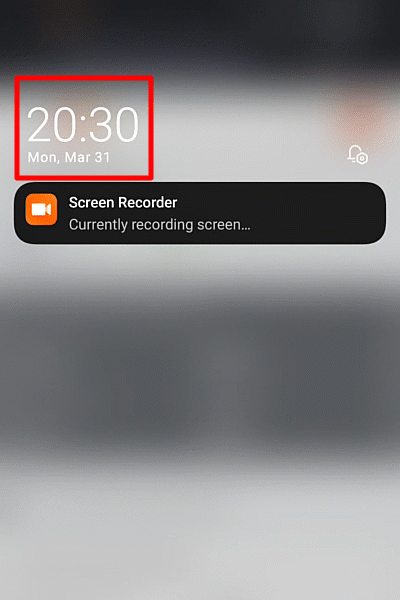

## __Chính sách và số lượng quảng cáo__

### __1. Chỉ một quảng cáo mỗi 2 ngày sử dụng ứng dụng__

- Khi khởi động, ứng dụng sẽ hỏi mọi người xem có hiển thị quảng cáo hay không.
Nếu mọi người xem ngay hoặc một lúc sau đó xem quảng cáo thì sau 2 ngày mới hiển thị lại

- __Nếu mọi người chọn "Bỏ qua" và để ứng dụng tự động hiển thị thì ứng dụng sẽ hiển thị quảng cáo một cách ngẫu nhiên khi bạn mở ứng dụng (Có thể sẽ là 2 đến 3 quảng cáo một ngày)__

- __Nếu mọi người chủ động xem, thì chỉ 1 quảng cáo mỗi 2 ngày sử dụng thôi.__

### __2. Em không kiếm được quá nhiều tiền khi ứng dụng hiển thị quảng cáo đâu ạ!__

*Số tiền kiếm được chỉ vừa đủ để ứng dụng hoạt động thôi ạ, em cũng không có lương khi làm ứng dụng luôn*

Mọi người nghĩ rằng đưa ứng dụng lên CH Play, có người sử dụng là em sẽ kiếm được tiền khi em không thu phí. Tuy nhiên, nó lại ngược lại.

- Không tính các chi phí khác, việc tạo tài khoản để đưa ứng dụng lên CH play cũng đã tốn khoảng 650,000VND rồi. Tạo tài khoản để đưa ứng dụng lên App Store (Của Iphone) cũng tốn khoảng hơn 2tr500 VND/năm.

- Với những ứng dụng offline thì không tốn chi phí duy trì hằng tháng, tuy nhiên sẽ là làm không công. Còn với ứng dụng Lịch VN đang cải tiến và thêm chức năng thì em phải chi thêm tiền cho máy chủ lưu trữ (Để lưu trữ chủ đề cho mọi người chọn)

- Mọi người đi làm thuê, có văn phòng, có máy lạnh. Còn em, làm ứng dụng này với mức thu 2tr500 (100 USD) thì còn chưa đủ trả tiền thuê cái phòng trọ nhỏ ở TpHCM nữa ấy, chứ chưa nói đến tiền thuê mặt bằng, tiền điện, tiền công. *(Sau khi trừ hết chi phí duy trì đi thì còn đúng cái nịt!)*

### __3. Công khai mức thu nhập__

*Có thể, sau khi điều chỉnh lượng hiển thị quảng cáo, những tháng sao có thể thu không tới 50USD/tháng. Bởi vì em đã cắt hơn 1 nửa quảng cáo trong phiên bản cập nhật này rồi.*

__Em không khuyến khích mọi người xem quảng cáo! Nếu có điều kiện, mọi người có có thể bỏ ra chỉ vài nghìn VND/tháng để mua gói Premium và loại bỏ quảng cáo.__
