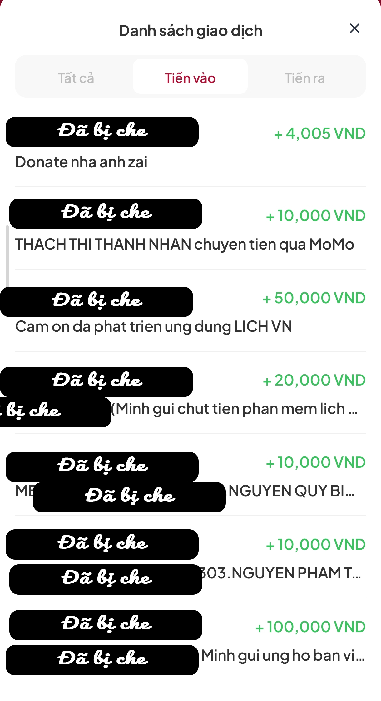

## __Cảm ơn hơn 10,000 anh/chị và các bạn đầu tiên – những người anh hùng thầm lặng!__

Em muốn gửi lời cảm ơn sâu sắc nhất tới 10.000 người dùng đầu tiên – những người đã lựa chọn sống chung với lũ, kiên nhẫn sử dụng ứng dụng của em trong giai đoạn “xấu đau xấu đớn”, quảng cáo thì "như mưa rào tháng 7", còn chức năng thì thiếu trước hụt sau như cơm nhà làm cuối tháng.

Từ đáy lòng mình, cảm ơn 10,000 lần!

Người Việt Nam có câu: __"Ăn quả nhớ kẻ trồng cây"__. Để đáp lại những yêu thương đó, em sẽ __tặng hơn 10,000 anh/chị và các bạn này gói dùng Premium miễn phí trong 2 năm__ khi ứng dụng đạt 100k downloads. Còn hiện tại, để báo đáp, em sẽ __giảm gói Premium xuống mức tối thiếu có thể thanh toán__ được. (Bởi vì nếu bây giờ nếu tặng ngay Premium thì ứng dụng sẽ không có doanh thu và không có kinh phí hoạt động).

## __Cảm ơn tất cả các bạn đã donate__

Em xin __tặng tất cả những anh/chị và các bạn có trong danh sách donate phía bên dưới gói dùng Premium miễn phí trọn đời__ cho tất cả những phần mềm mà em viết ra (__bao gồm ứng dụng Lịch VN này và tất cả những ứng dụng trong tương lai__)

Em vô cùng yêu mến những bạn này vì khi ứng dụng vừa xấu, vừa thiếu chức năng mà
những anh/chị và các bạn này đã donate vì muốn ủng hộ ứng dụng phát triển.

Tuy số tiền là không lớn, nhưng đó là tấm lòng của mọi người. Mọi người đã donate, tuy nhiên vẫn bị quảng cáo làm phiền và ứng dụng thì xấu nhưng vẫn donate.

Người Việt Nam có câu __"Một miếng khi đói bằng một gói khi no"__. Để đáp lại, em xin __tặng tất cả những anh/chị và các bạn có trong danh sách donate phía bên trên gói dùng Premium miễn phí trọn đời__ cho tất cả những phần mềm mà em viết ra (__bao gồm ứng dụng Lịch VN này và tất cả những ứng dụng trong tương lai__)

Em rất mong muốn sẽ được những anh/chị và các bạn có trong danh sách liên hệ lại với em qua trang facebook được ghi trong phần cuối của màn hình __Tiện Ích__. Anh/chị và các bạn chỉ cần gửi cho em __phần đã bị che là thời gian chuyển khoản__ để em xác minh và __gửi kèm email__ để em nhập vào hệ thống là được.

Cuối cùng, một lần nữa! Em __cảm ơn tất cả mọi người đã ủng hộ__.
