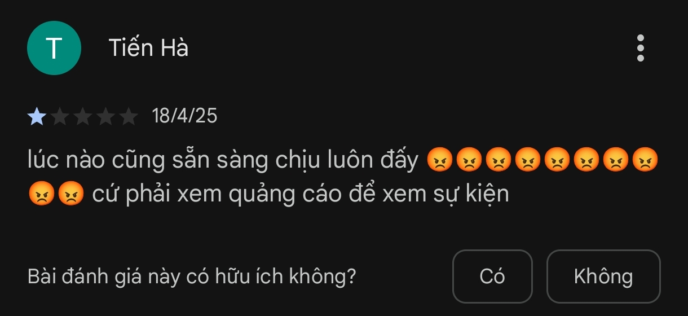

## __1. Lời cảm ơn và hậu tạ__

### __1.1 Cảm ơn__

Em vô cùng cảm ơn hơn 10,000 anh/chị và các bạn đã sử dụng ứng dụng trong thời gian vừa qua.

Trong lúc ứng dụng vừa xấu, vừa nhiều quảng cáo thì mọi người đã ở lại.

Tuy số tiền kiếm được từ quảng cáo là không nhiều (khoảng 2tr500VND thôi) nhưng nếu không nhờ có mọi người thì em cũng không có số tiền đó.

### __1.2 Hậu tạ__

Với anh/chị và các bạn ở lại thì chắc chắn đã nhận được hơn 1000 điển thưởng (hoặc thành xu ở bản cập nhật này). Em đã cố ý nâng mức nhận điểm thưởng thành 1,000 đến 10,000 điểm cho mỗi lượt hiện quảng cáo nhằm mục đích ghi dấu lại những bạn đã dùng phiên bản trước đó. Nếu hơn 1,000 điểm sẽ __trở thành FanCung__.

Người Việt Nam có câu: __"Ăn quả nhớ kẻ trồng cây"__. Để đáp lại, em sẽ:

- Em sẽ tặng mọi người __2 năm dùng Premium miễn phí__ khi ứng dụng đạt 100k+ downloads. Do nếu tặng ở thời điểm hiện tại thì những chi phí cố định hằng tháng em phải tự mình bỏ ra để duy trì ứng dụng và ứng dụng sẽ không thể hoạt động được.

- Hiện tại, em sẽ để __giá cho gói Premium ở mức tối thiểu__ cho tới khi đạt 100k+ downloads và giảm xuống còn 0VND cho 2 năm kế tiếp.

- Hiện tại, với mức thu 2tr500 thì em không thể lưu số xu và thông tin của mọi người lên máy chủ được (Việc mở rộng máy chủ, tăng băng thông sẽ tốn thêm tiền). Mọi người __hạn chế xóa dữ liệu ứng dụng__ hoặc __thay đổi thiết bị__ vì __số xu hiện tại sẽ bị mất__ và sẽ mất luôn trạng thái __FanCung__

### __2. Lời cảm ơn đặc biệt với những anh/chị và các bạn đã donate__

Trong những lúc __quảng cáo thì nhiều__, __ứng dụng thì xấu__, mà những anh/chị và các bạn vẫn này donate cho em __trong khi vẫn bị quảng cáo làm phiền__. Em rất trân trọng tấm lòng đó!

Người Việt Nam cũng có câu: __"Một miếng khi đó, bằng một gói khi no"__. Vì vậy, em xin hậu tạ:

- __Miễn phí gói Premium trọn đời cho tất cả các ứng dụng__ mà em làm (Bao gồm ứng dụng __Lịch VN Premium__ này và __tất cả các ứng dụng khác trong tương lai__)

- Miễn phí __Lịch VN Premium__ cho __bạn bè và người thân__. 

Anh/chị và các bạn có thể gửi cho em phần bị che là __thời gian giao dịch__ để em xác minh và __gửi kèm email__ để em nhập vào hệ thống.

Em rất mong anh/chị và các bạn có thể liên hệ lại để em hậu tạ và __gửi lời cảm ơn trực tiếp__ thông qua phần liên hệ ở cuối màn hình __"Tiện Ích"__.

Một lần nữa! __Em xin cảm ơn tất cả sự yêu thương đến từ mọi người__.
