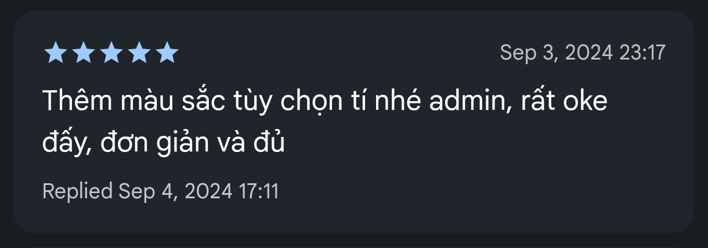
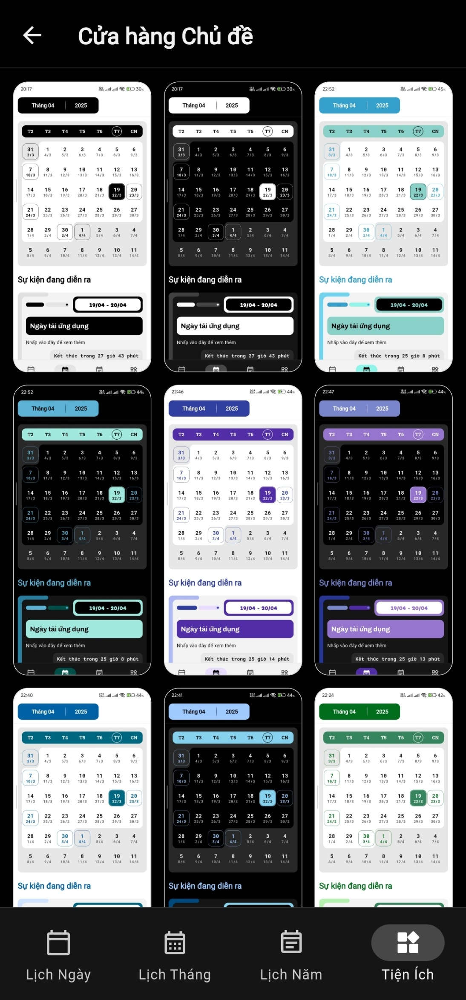
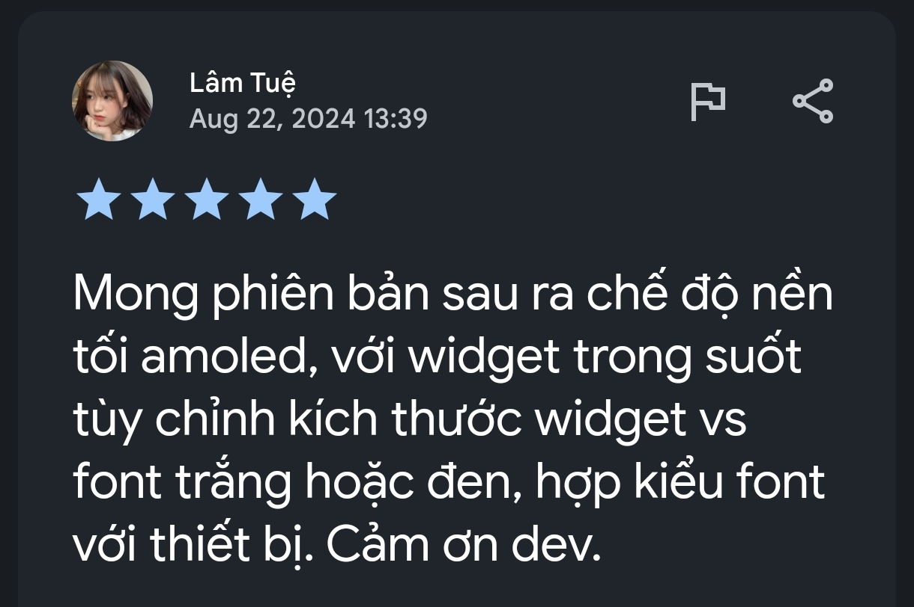
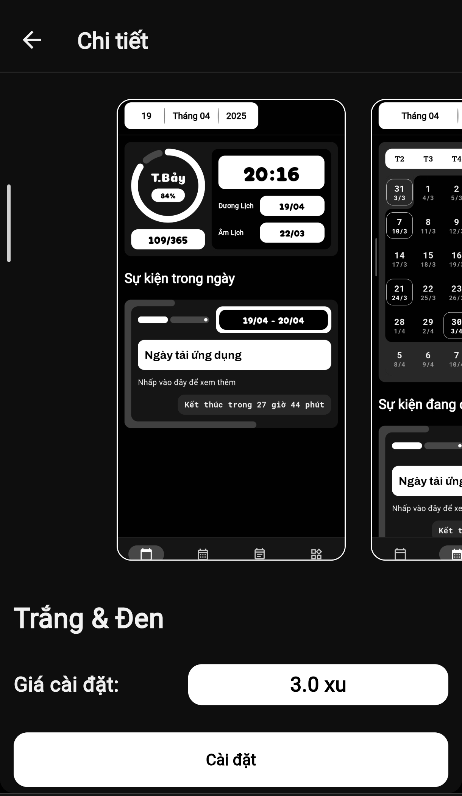
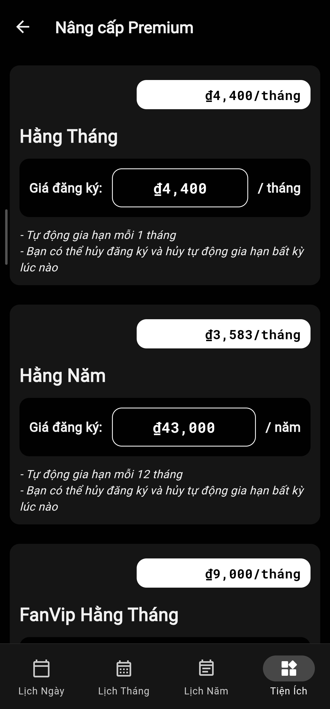

### __1. Yêu cầu thêm màu sắc, chủ đề__

### __2. Có chủ đề riêng cho những bạn dùng màn hình OLED__

### __3. Ra mắt tính năng Premium với giá chỉ vài nghìn VND__

### __4. Cải thiện giao diện lịch tháng bắt mắt, dễ nhìn hơn__

Mọi người có thể thấy nó hơi xấu lúc đầu. Tuy nhiên, khi nhìn quen mắt thì thấy nó sẽ rất đẹp.

