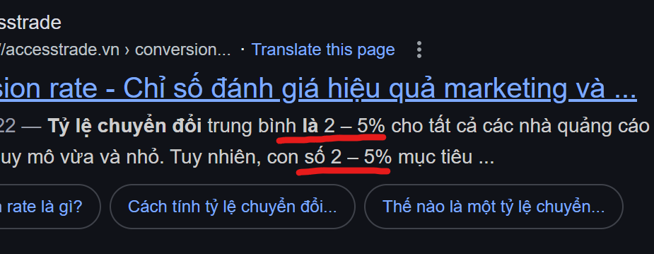
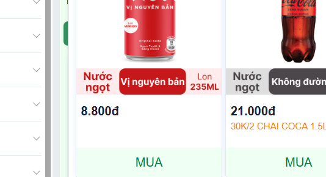
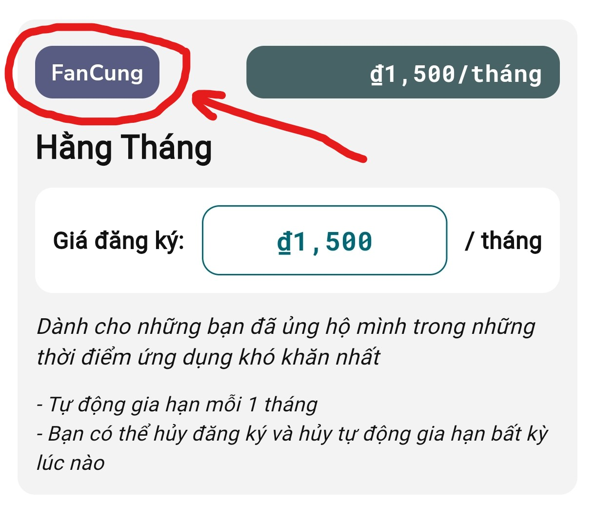
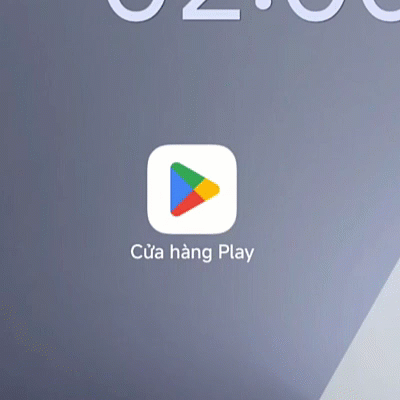

### __1. Giá ứng dụng là rất rẻ__

- Ví dụ, có 1000 lượt đăng ký với 10k+ downloads (__Tỉ lệ chuyển đổi 10%__)

- Mức thuế: 5% => thu nhập tối đa sau thuế là __95%__

- Chiết khấu cho google play 15% -> 30% => Thu nhập sau chiết khấu tối đa là __85%__

- Chi phí marketing (Chạy quảng cáo): Khoảng __30% => 50%__ *(Em sẽ xem như là không tốn phí marketing)* 

- Gói đăng ký __3000__ VND/tháng

__=> Vậy suy ra, em có thể thu được__: (3000 * 1000) * 0.95 * 0.85 = __2,422,500__ (2tr422)

Ở ví dụ trên, __tỉ lệ chuyển đổi 10%__ gần như phi thực tế, để có được 1000 người đăng ký gói tháng là rất khó bởi vì:

- Nhiều cô/chú anh/chị __không có tài khoản ngân hàng__ hoặc __không có thẻ visa để thanh toán quốc tế và mua ứng dụng.__

- Người Việt Nam rất ít khi muốn mua ứng dụng trả phí.

Đó chỉ là chi phí thu vào lúc đầu chưa trừ đi chi phí __máy chủ, phí tên miền, phí dịch vụ khác, phí phần mềm edit, dịch vụ lưu trữ...__ và em chưa có tí công nào sau khi trừ hết chi phí luôn.

Dù mọi người có __đăng ký gói 9,000 VND/tháng__ thì mức thu nhập thực tế em có thể đạt được với 1000 người đăng ký là __4tr VND/tháng__ thôi (Thua mức lương cơ bản) - *đó là em loại bỏ luôn chi phí tiền điện, nước, chi phí trang thiết bị và mặt bằng luôn rồi mới có được mức thu nhập đó*. 

__=> Em công khai mức thu nhập là để nói rằng những gói đăng ký bên dưới là rất rẻ và ưu đãi__

### __2. Ứng dụng sẽ được neo giá với giá bán 1 lon Coca-cola 330ml__

- Hiện tại, lạm phát đang tăng, kinh tế bất ổn. Em chỉ lấy giá __1/2 lon Coca__ thôi! 

- Mọi người, __ai có điều kiện hơn__ thì có thể mua gói với __giá 1 lon Coca__ hoặc __2 lon Coca__ đê ủng hộ.

### __3. Ưu đãi cho FanCung__

- Riêng đối với những anh/chị và các bạn đã dùng ứng dụng một thời gian thì sẽ là FanCung và sẽ đăng ký được gói như hình bên dưới

### __4. Hủy bất cứ lúc nào__

- Anh/chị và các bạn có thể hủy bất kỳ lúc nào.

- Việc quản lý gói Premium là do google thu phí và quản lý. Vậy nên, mọi người có thể hủy gói __Lịch VN Premium__ giống như cách hủy gói __Youtube Premium__

### __5. Lợi ích__

- __Miễn phí hầu hết các vật phẩm__ có trong ứng dụng

- __Loại bỏ quảng cáo trên tất cả các thiết bị có đăng nhập chung một tài khoản google__

- Nếu anh/chị và các bạn có __một máy tính bảng__ và __một điện thoại__ có đăng nhập __chung một gmail__ là abc@gmail.com __thì cả 2 thiết bị đó đều sẽ có gói Premium__. *Lưu ý: abc@gmail.com là gmail ví dụ*.
