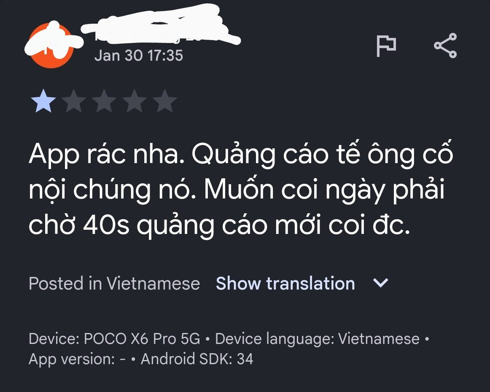
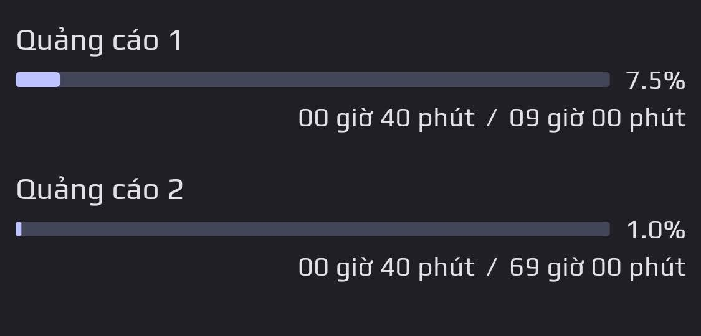
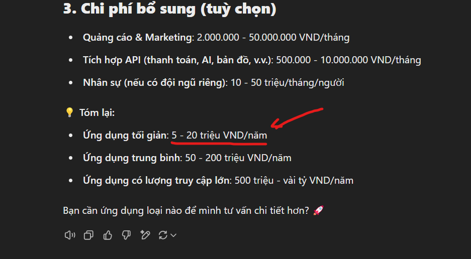

# Ứng dụng này có chứa quảng cáo!

## 1. Lý do ứng dụng có chứa quảng cáo

Mình chèn quảng cáo vào app không phải là để "tế ông nội" đâu bạn!

Mình cũng đâu thể nào hít không khí để sống qua ngày và làm ứng dụng được đâu.

Việc tạo tài khoản để đưa ứng dụng lên CH Play cũng đã tốn hơn 600k (khoảng 25USD), còn để đưa ứng dụng lên App Store thì sẽ phải tốn khoảng 2tr500. Đó là khoản phí rất nhỏ lúc đầu, ngoài ra còn vô số các khoản chi phí rất lớn phía sau.

Để xây dụng một kho theme (chủ đề), mình cần một máy chủ. Mà để có tiền duy trì máy chủ, mình cần tạo ứng dụng trả phí hoặc chèn quảng cáo. Mình mong các bạn có thể thông cảm.

## 2. Số lượng và thời gian quảng cáo

### 2.1 Quảng cáo 1

- Hiển thị quảng cáo sau mỗi 9 giờ - Tránh việc hiển thị quảng mỗi lần bạn mở ứng dụng gây phiền.

- Quảng cáo kéo dài từ 5 giây tới 30 giây (Quảng cáo là do google cấp, mình không can thiệp được). Bạn có thể nhấn vào nút (X) phía trên quảng cáo để tắt mà không phải xem hết 40 giây đâu bạn. Thông thường, bạn có thể tắt quảng cáo sau 5 giây.

- Ý nghĩa: Chi phí duy trì ứng dụng

### 2.2 Quảng cáo 2

- Hiển thị sau mỗi 69 giờ

- Ý nghĩa: Chi phí việc phát triển tính năng mới

### 2.3 Các quảng cáo khác

- Tự dộng được ẩn, bạn cần phải tự bật thì mới được hiển thị.

## 3. Phụ lục

