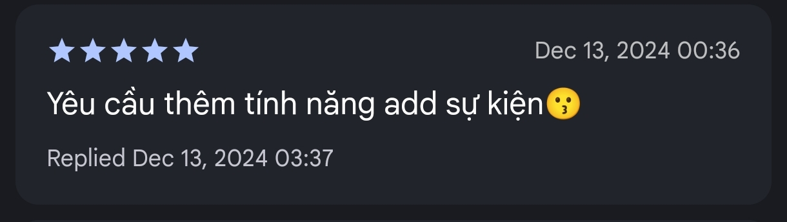
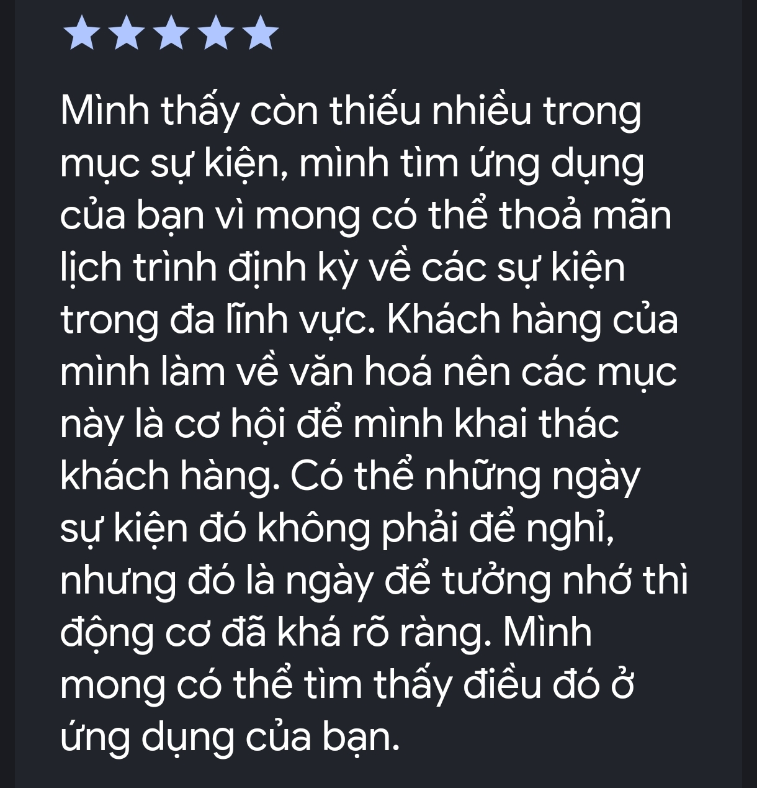

# Hệ thống điểm thưởng và ý nghĩa

## 1. Ý nghĩa

Mình tạo ra hệ thống điểm thưởng này để ghi công những bạn đã ủng hộ mình phát triển ứng dụng. Ở những ứng dụng khác, quảng cáo vẫn được hiển thị tuy nhiên bạn vẫn phải nạp thêm tiền hoặc xem thêm quảng cáo để mua theme (chủ đề) và các vật phẩm đi kèm. Tuy nhiên, với ứng dụng của mình thì khi bạn ủng hộ mình, mình sẽ tặng lại cho các bạn tương ứng.

Việc tạo và duy trì ứng dụng vô cùng tốn kinh phí, đặc biệt là những ứng dụng cần một hệ thống máy chủ đi kèm. Chi phí để tạo tài khoản để đưa ứng dụng lên CH Play là hơn 620'000 VND (25USD), chi phí duy trì tài khoản trên App Store là hơn 2'475'000 VND (99USD). Ngoài ra còn nhiều khoản chi phí vô cùng lớn phía sau như: chi phí thuê tên miền, thuê server và nhiều dịch vụ đi kèm khác. Ngoài những khoản chi phí đó ra thì nhiều tháng công sức với nhiều đêm không ngủ để phát triển ứng dụng. Bạn có thể xác minh những khoản chi phí đó bằng các nguồn khác nhau hoặc hỏi chatGPT. Để ra thêm tính năng mới thì mình cần sự giúp đỡ từ bạn. Vì vậy, mình mong bạn có thể ủng hộ mình.

Chi phí để duy trì ứng dụng lớn vậy thì đừng thuê server nữa cho đỡ tốn? Câu trả lời là điều này sẽ làm tăng dung lượng của ứng dụng lên rất nhiều. Ví dụ, 1 hình ảnh tốn khoảng 1MB thì nếu ứng dụng có 100 hình ảnh thì ứng dụng sẽ phình to thêm 100MB. Bạn đâu thể nào tải toàn bộ video trên youtube về để xem offline đúng không? (Bài viết mà bạn đang đọc cũng cần có máy chủ để lưu trữ).

### 1.1 Mình kiếm được bao nhiêu tiền từ quảng cáo?

Hiện nay giá quảng cáo ở Việt Nam là rất thấp. Giá quả cáo hiện giao động trong khoảng 3VND => 50VND cho một lần hiển thị. Giá quảng cáo cao nhất có thể rơi vào những ngày lễ tết nhưng trung bình khoảng 8VND/1 làn hiển thị. Nếu mỗi ngày, bạn mở ứng dụng lên và hiện __1__ quảng cáo với giá là __12__ VND thì sau __1__ năm mình có thể kiếm được 12x365 = __4'380__ VND. Nhưng, nếu có 1000 bạn ủng hộ mình mỗi ngày thì mình sẽ thu được khoảng hơn 4 triệu VND. Tuy nhiên, cuộc sống không giống cuộc đời, bạn đâu có xem lịch mỗi ngày như cái cách mà bạn dùng facebook, zalo hay youtube? Số người dùng ứng dụng lịch của mình cũng đâu có nhiều (hiện tại có 10k+ downloads). 1 download đâu có đồng nghĩa với 1 người sử dụng đâu, bạn có thể gỡ và tải ứng dụng khác. Tuy nhiên, 1 download đó vẫn được hệ thống ghi nhận.

## 2. Kiếm thêm điểm thưởng như thế nào?

Điểm thưởng sẽ tự động được tích lũy trong quá trình bạn sử dụng ứng dụng và sau những lần hiển thị quảng cáo.

Bạn có thể kiếm thêm điểm thưởng bằng cách nhấn vào nút xem quảng cáo trong màn hình __Tiện ích__.

## 3. Điểm thưởng dùng để làm gì?

Bạn có thể dùng điểm thưởng để mua thêm các chủ đề và các vật phẩm đi kèm mà không cần phải đăng ký gói premium.

Vì mình chưa hoàn kịp hoàn thiện tích năng chọn theme trong ứng dụng nên trong khoảng thời gian chờ đợi thì thì mọi điểm thưởng mà bạn tích sẽ được nhân 5 lần. Sau khi kho theme được hoàn thành thì gần như bạn có thể sở hữu mọi theme mà bạn muốn (dự kiến giá download cho theme cơ bản sẽ là 1 điểm thưởng).
