## Ý nghĩa

Để có kinh phí làm thêm các tính năng mới cho ứng dụng, mình buộc phải chèn quảng cáo vào ứng dụng (Chi phí thuê server là rất lớn).

Mình cũng biết, quảng cáo làm bạn cảm thấy khó chịu. Vậy nên, tất cả quảng cáo đều là dạng quả cáo có trả thưởng (Rewarded). Khi bạn xem hết quảng cáo, bạn sẽ nhận được __điểm thưởng__ tương ứng.

Mình đã giới hạn tần suất hiển thị quảng cáo xuống mức thấp nhất có thể để bạn không cảm thấy khó chịu rồi.

Mình đã hứa với các bạn là sẽ cập nhật nhiều tính năng và giao diện cho ứng dụng trước tết âm lịch. Tuy nhiên, hôm nay mùng 1 tết âm lịch mình mới có thể cập nhật cho bạn. Mình vô cùng xin lỗi các bạn.

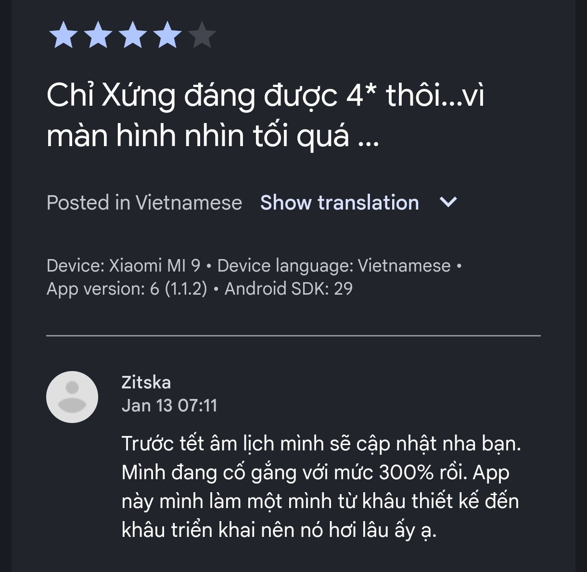

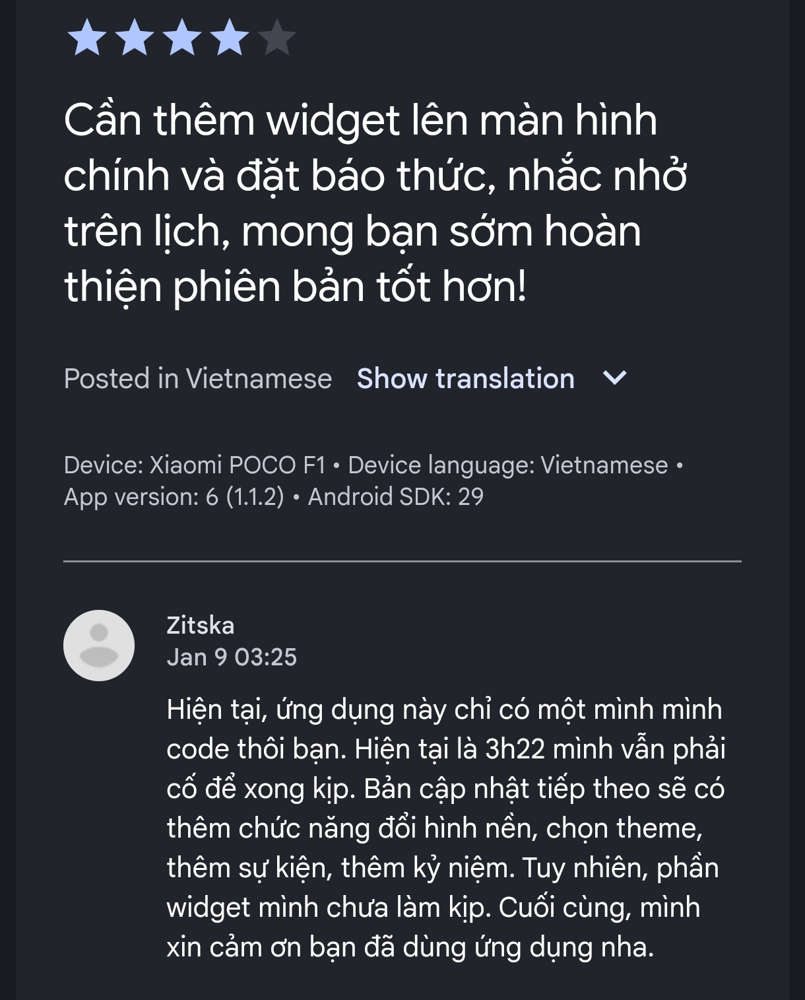

## Làm sao để tắt quảng cáo

Mình thấy, quảng cáo trong ứng dụng rất thiếu thẩm mỹ. Tuy nhiên, mình đã cố gắng lắm rồi nhưng chưa hoàn thiện được chức năng tùy chỉnh và tắt quảng cáo ở một số vị trí. Mình vô cùng xin lỗi các bạn về những trải nghiệm của bạn trong phiên bản hiện tại. Để bù đắp, mình đã làm cho quảng cáo trở nên đẹp hơn và giới hạn tần suất hiển thị quảng cáo toàn màn hình lại ở mức thấp nhất có thể.

## Điểm thưởng được tính như thế nào?

Với mỗi lần hiển thị quảng cáo toàn màn hình (Rewarded Ad) thành công thì bạn sẽ nhận được 1 điểm thưởng. Với mỗi 1 đến 2 điểm thưởng thì bạn có thể đổi được 1 theme tương ứng.

Điểm thưởng cũng được ghi nhận ở những lần hiển thị quảng cáo khác trong ứng dụng thành công. 

## Mua theme (chủ đề) như thế nào?

Mình đã cố gắng 300% rồi, nhưng không kịp hoàn thành kho theme cho các bạn lựa chọn.

Hiện tại, mình cần phải hoàn thiện phần máy chủ lưu trữ theme dành cho các bạn nên các bạn đợi một xíu nha.

Trong quá trình chờ đợi, điểm thưởng sẽ được nhân 300% cho mỗi lần quảng cáo được hiển thị.

Dưới đây là một số theme mình đã chuẩn bị, nhưng chưa hoàn thiện phần máy chủ lưu trữ:

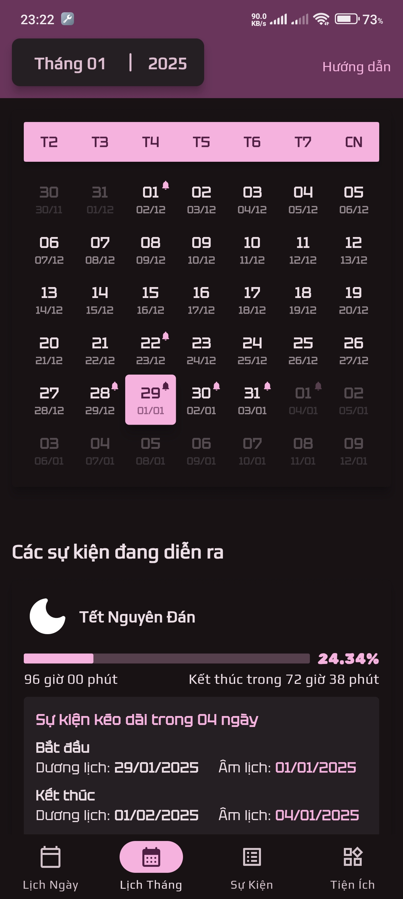

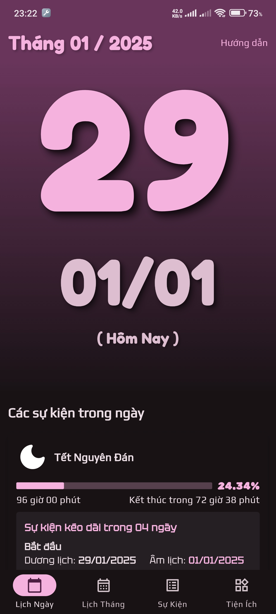

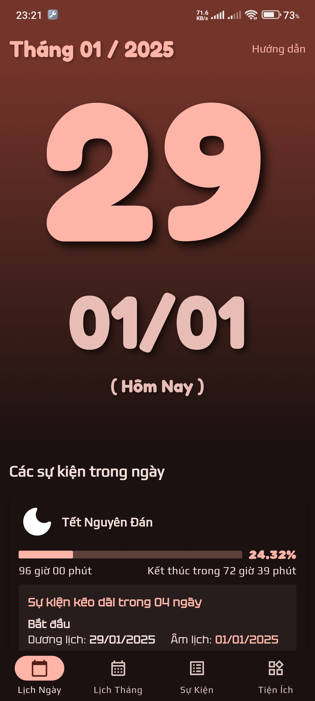

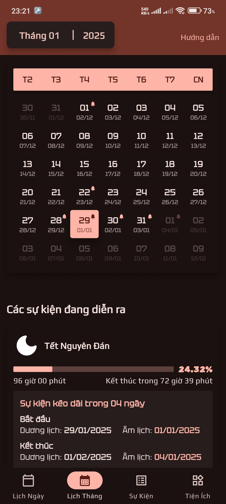

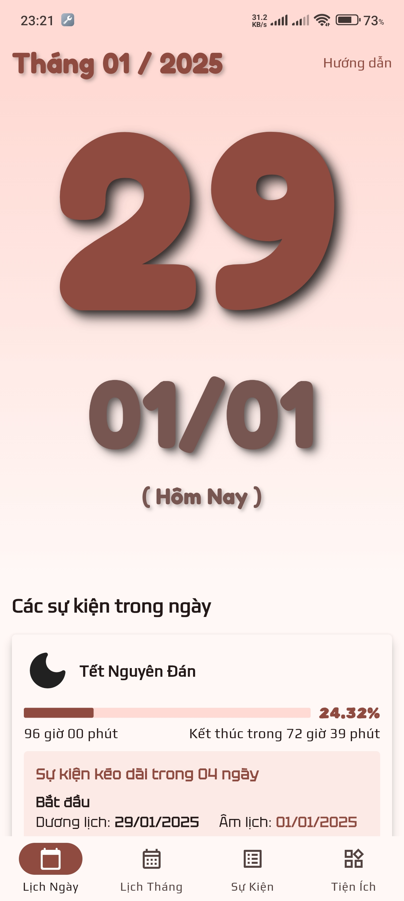

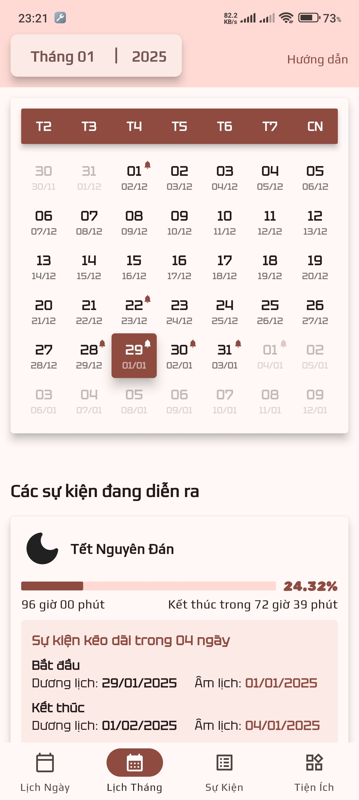

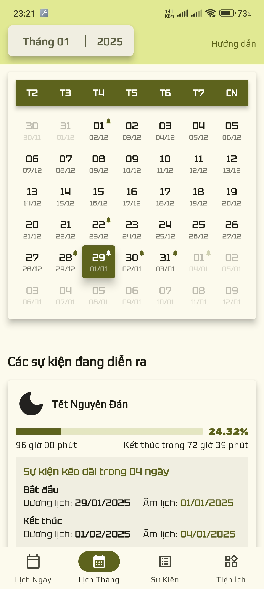

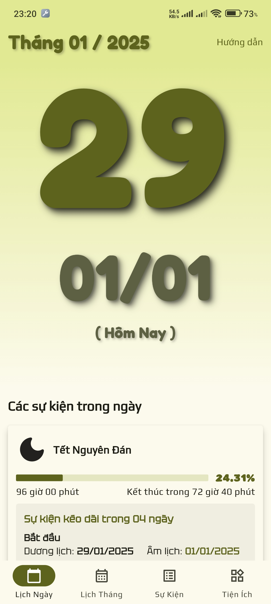

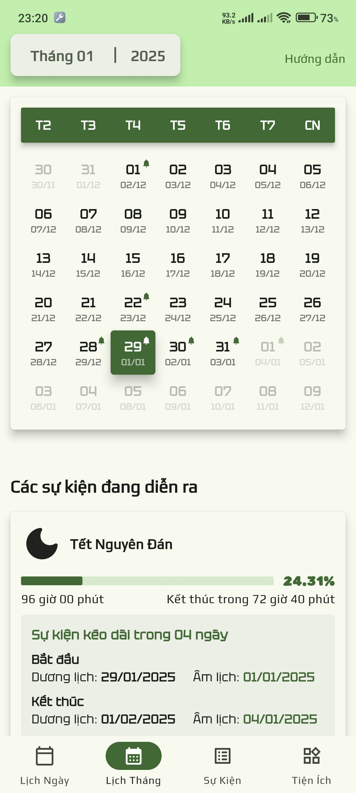

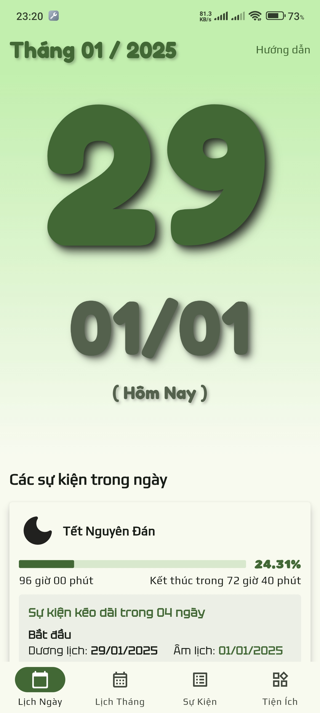

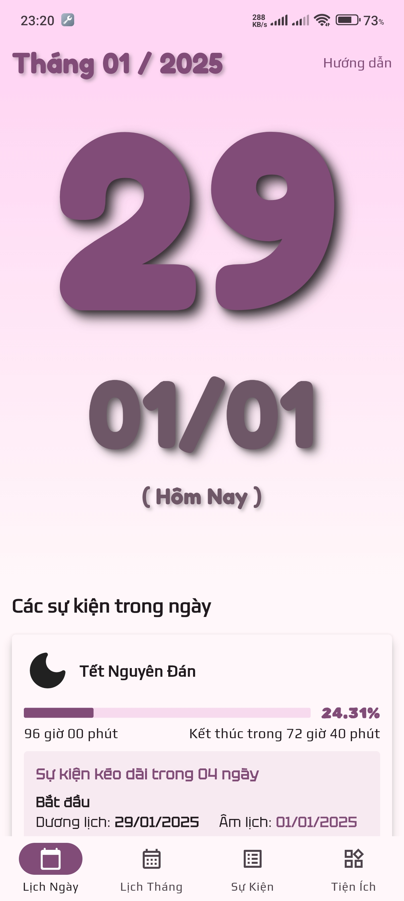

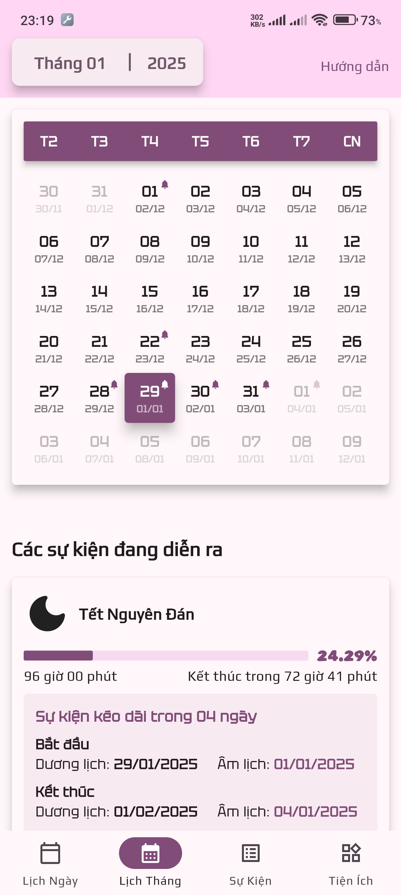
