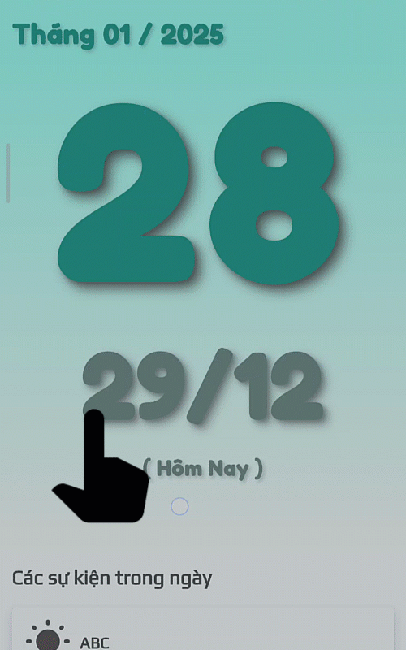
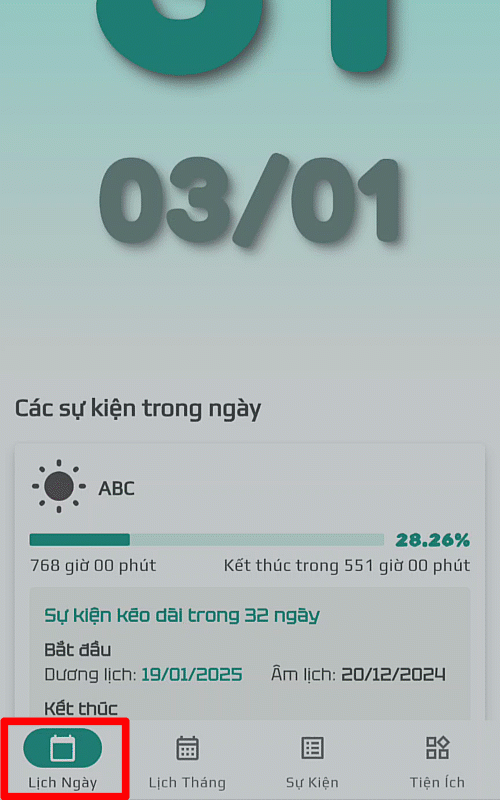

## Chuyển qua màn hình khác

__Vuốt sang trái__ hoặc __vuốt sang phải__ để di chuyển qua ngày kế tiếp hoặc ngày trước đó.

## Trở về ngày hiện tại

Nhấn lại vào nút "__Lịch Ngày__" để trở về ngày hiện tại.

