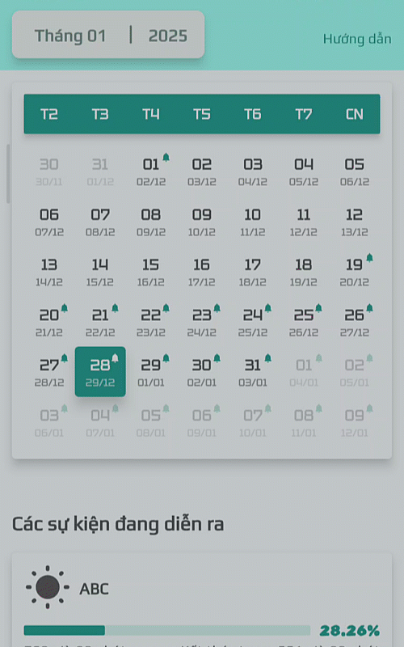
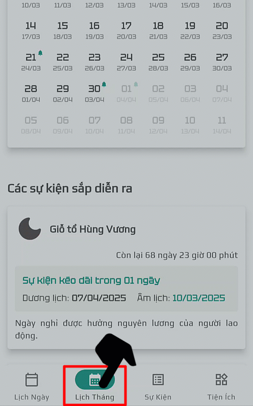

## Chuyển qua tháng khác

__Vuốt sang trái__ hoặc __vuốt sang phải__ để di chuyển qua tháng kế tiếp hoặc tháng trước đó.

## Trở về tháng hiện tại

Nhấn lại vào nút "__Lịch Tháng__" để trở về tháng hiện tại.

